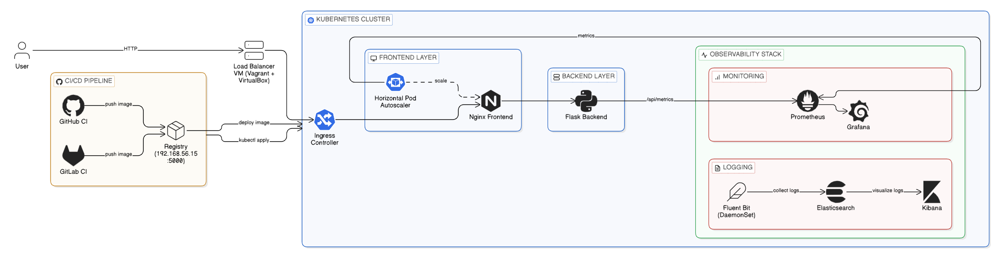

# Cluster Chronicles: End-to-End Observability Lab

Cluster Chronicles is a local VM-based lab for demonstrating a production-style delivery stack with Vagrant, Docker, Kubernetes, ELK, and monitoring.

## Vagrant: A brief Introduction to our Pocket VM
Vagrant is used to provision and reproduce the virtual machines that make the lab consistent across runs, while Docker, Kubernetes, ELK, and monitoring services show the application and observability workflow end to end.

## What This Project Delivers

- Dockerizes HTML, CSS, and JavaScript for the frontend
- Dockerizes Python for the backend
- Dockerizes the ELK stack
- Demonstrates the installation steps for the entire DevOps Stack
- Configures Kubernetes to run the frontend and backend
- Configures Prometheus to scrape metrics from the frontend and backend
- Configures Grafana to visualize metrics from Prometheus
- Dockerizes Prometheus and Grafana

- Configures ELK to collect logs from the frontend and backend

## Architecture at a Glance

```text
Host / Browser
   |
   v
Load Balancer VM (lb1)
   |
   v
Kubernetes node (app1 / k3s)
  |                   |
  v                   v
Frontend Pods     Backend Pods (Flask)
            |
            v
         Prometheus + ELK ingestion
```
## Architecture Diagram



## Repository Layout

- [backend/app.py](backend/app.py): Flask API and metrics endpoints
- [backend/tests/test_basic.py](backend/tests/test_basic.py): Basic backend test scaffold
- [frontend/index.html](frontend/index.html): Frontend dashboard page
- [frontend/app.js](frontend/app.js): Dashboard logic and API fetch flow
- [manifests/kubernates](manifests/kubernates): App, ingress, logging, and monitoring manifests
- [provision](provision): VM provisioning scripts
- [scripts/local-deploy.sh](scripts/local-deploy.sh): Image build/push and Kubernetes apply helper
- [docs/vm-k8s-cicd-runbook.md](docs/vm-k8s-cicd-runbook.md): Full VM + k3s + CI/CD + monitoring runbook

## Core Application Endpoints

Backend service (via ingress or reverse proxy):

- `GET /api/health` -> basic health status
- `GET /api/metrics` -> Prometheus metrics format
- `GET /api/metrics-json` -> structured runtime and system metrics

Frontend service:

- `GET /` -> dashboard with health, system metrics, and raw JSON payload

## Quick Start (Local VM Lab)

### Prerequisites

Before you begin, install:

- VirtualBox
- Docker Engine
- Vagrant


1. Install the prerequisites above, then use the Vagrant workflow below to launch the lab.
2. Start the lab:

```powershell
vagrant up
```

3. Verify base reachability:

```powershell
curl http://192.168.56.10/
curl http://192.168.56.10/api/health
curl http://192.168.56.10/api/metrics-json
```

For the complete setup sequence (k3s, CI/CD, monitoring, ELK), use:

- [docs/vm-k8s-cicd-runbook.md](docs/vm-k8s-cicd-runbook.md)

## Build and Deploy Workflow

The project includes a straightforward deployment path:

1. Build frontend and backend images
2. Tag and push images to the local registry (`192.168.56.15:5000`)
3. Apply Kubernetes manifests
4. Restart deployments for rollout

Reference commands are in:

- [scripts/local-deploy.sh](scripts/local-deploy.sh)

## Stack

- Backend: Python 3.12, Flask, Prometheus Python client, psutil
- Frontend: Nginx static app (HTML/CSS/JS)
- Orchestration: k3s / Kubernetes
- Infrastructure: Vagrant + VirtualBox
- Observability: Prometheus, Grafana, Elasticsearch, Kibana, Fluent Bit

## Validation Checklist

- Frontend UI loads through load balancer or ingress
- `/api/health` returns `OK`
- `/api/metrics` is scrapeable by Prometheus
- `/api/metrics-json` returns host, CPU, memory, and uptime data
- Kubernetes pods are healthy (`kubectl get pods`)

## Security and Operational Notes

- Do not commit secrets, private keys, runner tokens, or WireGuard config
- Keep local environment files outside version control
- Use the included `.gitignore` to prevent accidental secret leakage

## Troubleshooting

- If images do not pull, verify local registry accessibility from the k3s node
- If endpoint responses fail, inspect backend pod logs and service selectors
- If dashboard is blank, confirm frontend can reach backend at configured `BACKEND_URL`